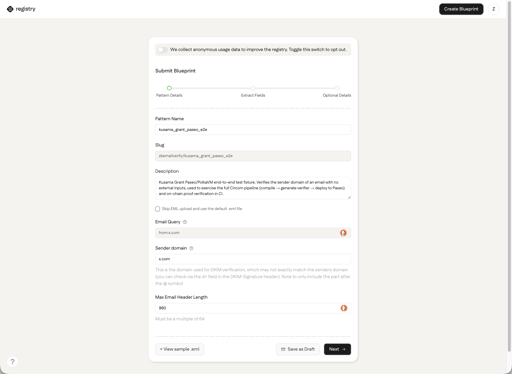
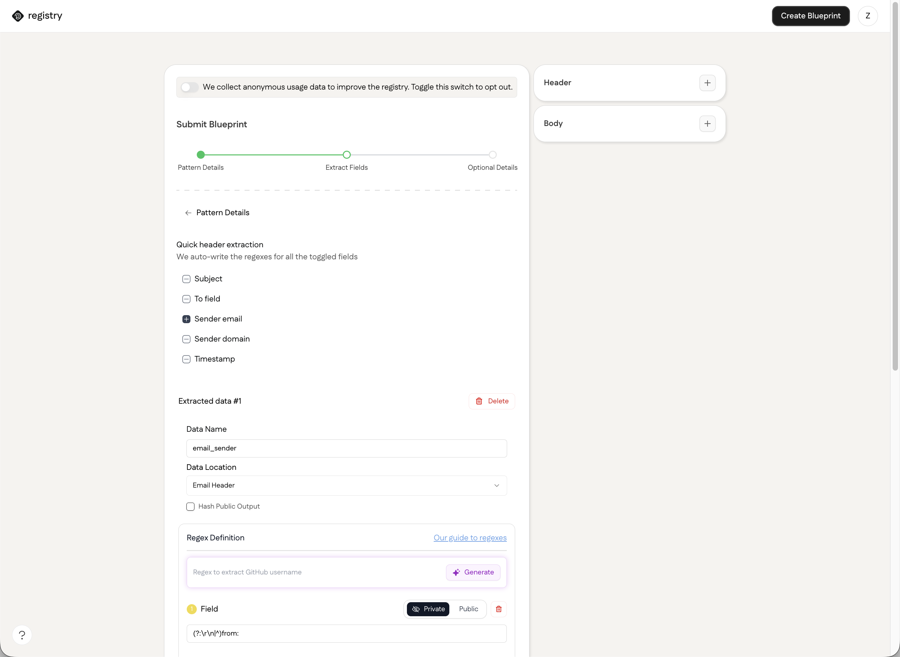
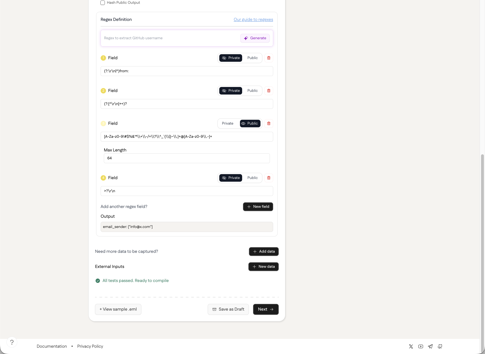
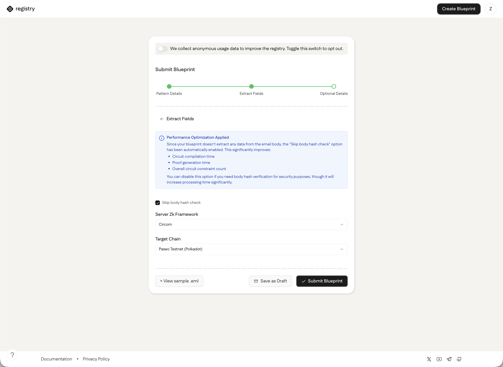
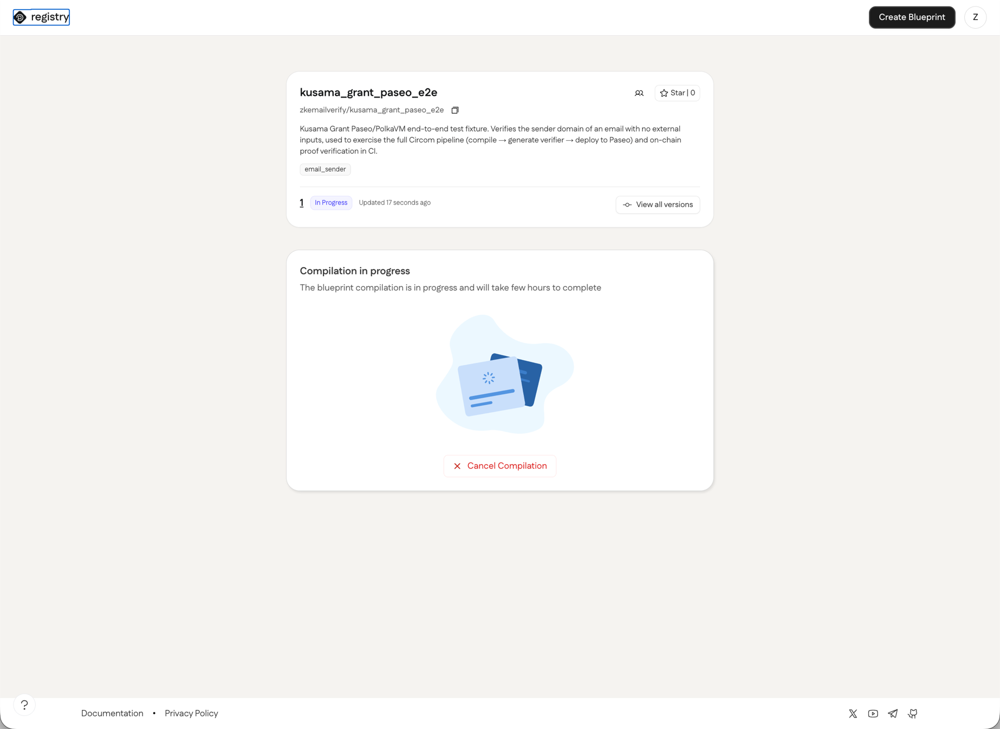
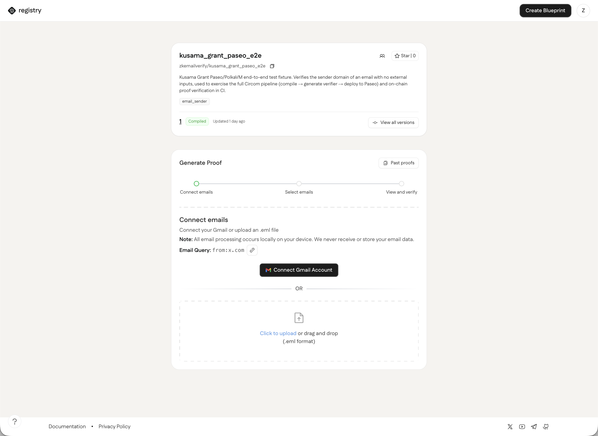
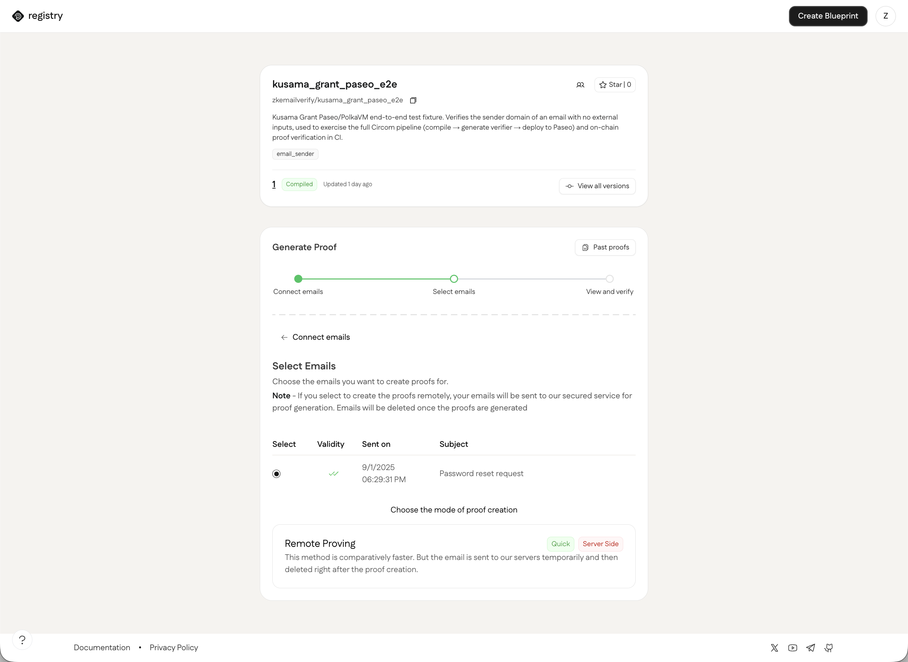
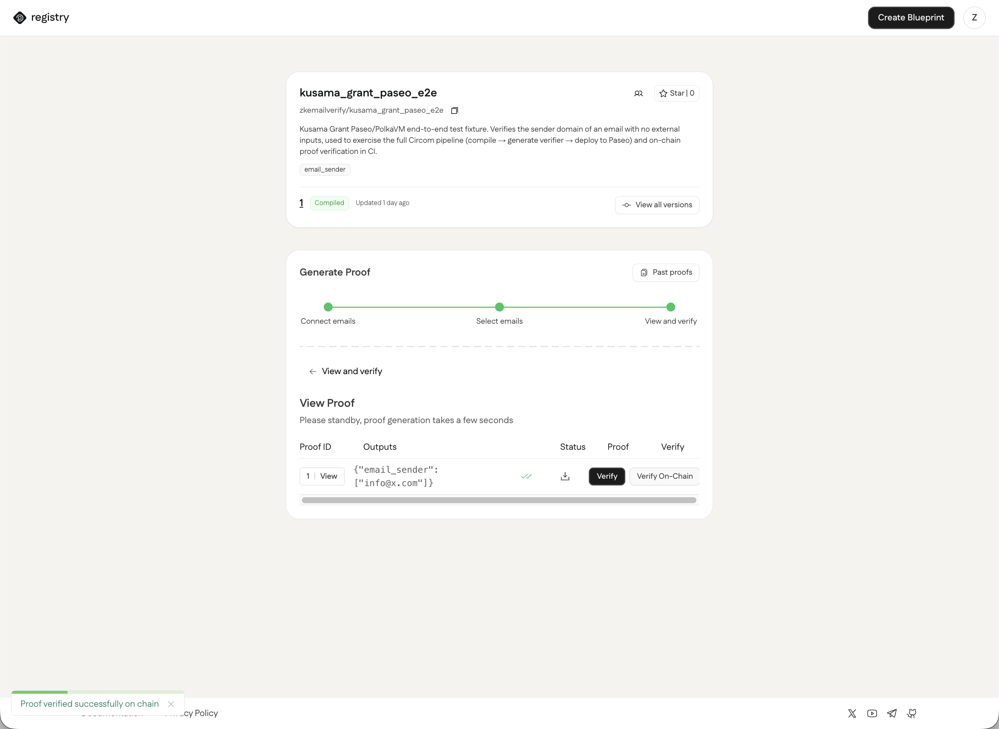
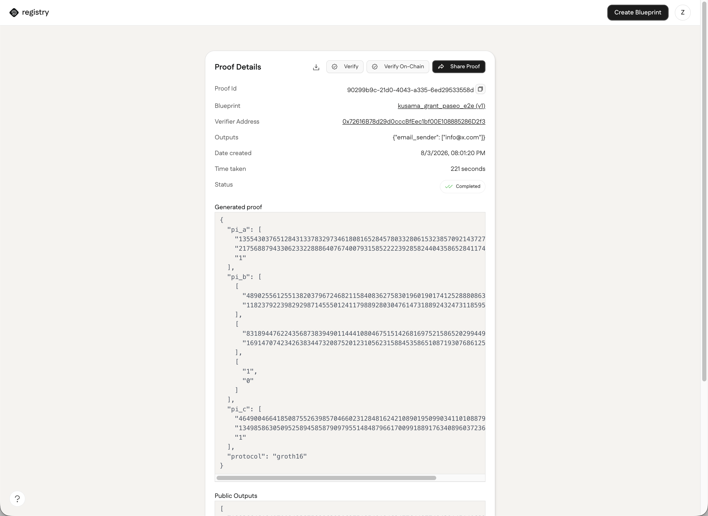

# 06 - Public How-To: Creating a Blueprint and Verifying On-Chain on Paseo

Step-by-step walkthrough of the deliverable 5 golden path in the registry frontend: create a blueprint targeting Paseo, upload an email, generate a proof, and verify it both locally and on-chain, using only the UI.

## 1) Create a blueprint

Click **Create Blueprint** and fill in the pattern details: a name, description, etc.

On the next step, choose which fields to extract. Quick header extraction toggles (Subject, To field, Sender email, Sender domain, Timestamp) auto-write the regexes for you - each one can be marked Public or Private.

Scrolling down shows the generated regex for each field, an editable Max Length, and a live test against the sample email. Once it reads "All tests passed. Ready to compile", move on.

On the final step, set **Target Chain** to **Paseo Testnet (Polkadot)** then click **Submit Blueprint**.

## 2) Wait for compilation

Compilation happens server-side: the circuit is compiled, a Solidity verifier is generated, and it's deployed to Paseo. Depending on complexity, this can take more than an hour - the blueprint's status badge reads **In Progress** in the meantime, with an option to cancel.

Once the badge reads **Compiled**, the blueprint is ready to generate proofs against.

## 3) Upload an email and generate a proof

On the blueprint page, upload an `.eml` file matching the sender domain (or connect Gmail).

Select the email to prove and press **Remote Proving**.

## 4) Verify the proof

Once generation finishes, the proof row shows its outputs, a validity checkmark, a button to download the proof, and both a **Verify** and a **Verify On-Chain** button. **Verify** checks the proof locally in the browser. **Verify On-Chain** calls the deployed verifier contract's view function on Paseo and reports the result of verification:

## 5) Find the deployed contract address

Open the proof's detail page to see the full generated proof, its public outputs, and the **Verifier Address** - the deployed contract on Paseo that `Verify On-Chain` calls. The address links out to the block explorer for independent inspection. The proof can also be downloaded from this page.

